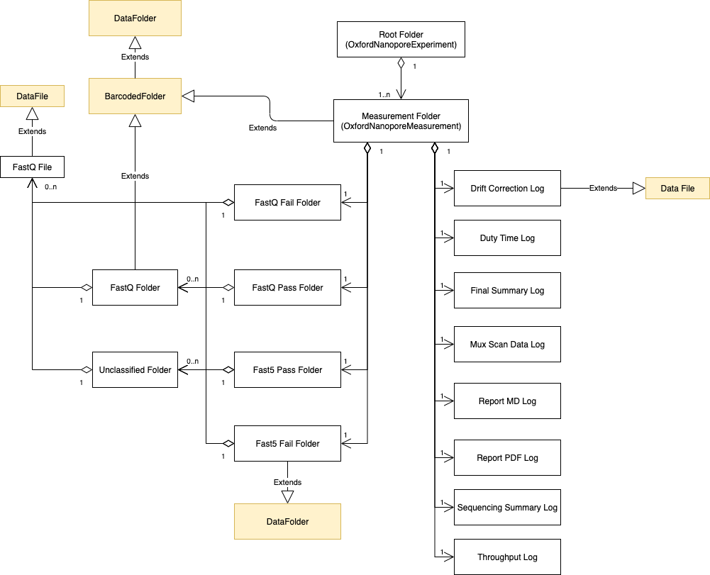
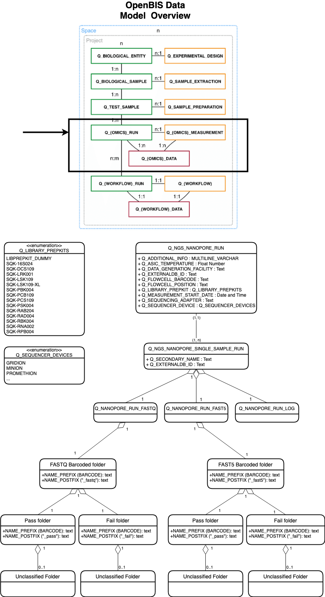
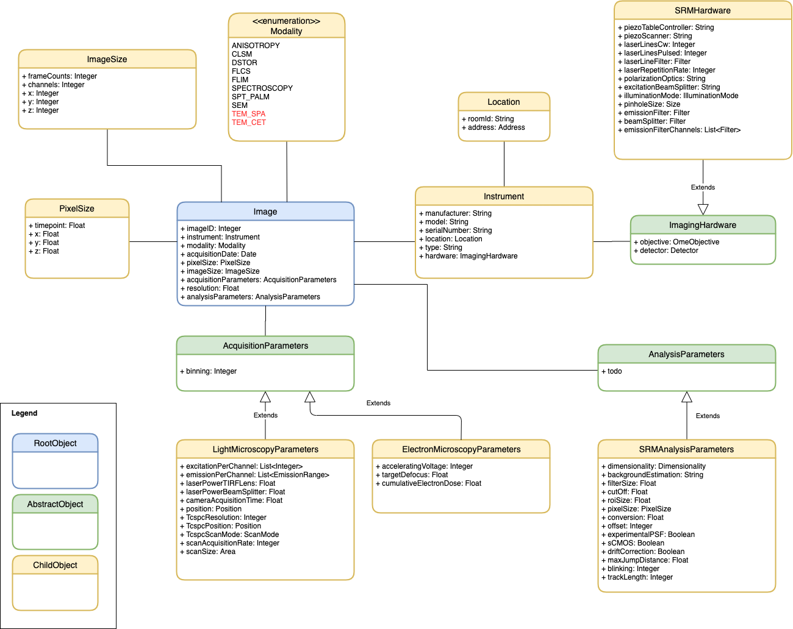

# Data Model Library
[](https://travis-ci.com/qbicsoftware/data-model-lib)[](https://codecov.io/gh/qbicsoftware/data-model-lib)

Data Model Library - A collection of QBiC data models.

## Author
Created by Andreas Friedrich, Luis de la Garza, Sven Fillinger.

## How to Install

With Maven you can include the library as dependency with:

```XML
<dependency>
  <groupId>life.qbic</groupId>
  <artifactId>data-model-lib</artifactId>
  <version>1.10.0</version>
</dependency>
```
or Groovy Grape:

```
@Grapes(
  @Grab(group='life.qbic', module='data-model-lib', version='1.9.0')
)
```

Make sure, that you have defined the Github package Maven repository, in order for Maven to resolve the dependency properly:

```XML
<repositories>
  <repository>
    <id>github</id>
    <name>GitHub OWNER Apache Maven Packages</name>
    <url>https://maven.pkg.github.com/qbicsoftware/data-model-lib</url>
    <releases><enabled>true</enabled></releases>
    <snapshots><enabled>true</enabled></snapshots>
  </repository>
</repositories>
```


## Models

## Nanopore Data Structure

A Nanopore NGS measurement output is delivered to us as a nested folder structure, following this model:



## OpenBIS Data Overview 

The Nanopore data structure is saved in an openBIS 18.06.2 database. 
An overview of the openBIS data model and the location and entity relationship of the Nanopore data stucture within it can be seen in this diagram: 




### Example

For complete examples, see the [JSON example files](./src/test/resources) provided for the unit tests.

In order to create an instance of type `OxfordNanoporeExperiment`, you need to provide a map that provides content following the [Nanopore Instrument Output Schema JSON](./src/main/resources/schemas/nanopore-instrument-output.schema.json).  
Every measurement folder also needs to be enriched with metadata, which itself is specified with another [JSON schema](./src/main/resources/schemas/ont-metadata.schema.json).

The final map contains an additional `metadata` property for each measurement, that for example can look like this:

```
{
    "name": "QABCD001AB_E12A345a01_PAE12345",
    "path": "./",
    "children": [
        {
            "name": "20200122_1217_1-A1-B1-PAE12345_1234567a",
            "metadata":  {
                "adapter": "flongle",
                "asic_temp": "32.631687",
                "base_caller": "Guppy",
                "base_caller_version": "3.2.8+bd67289",
                "device_type" : "promethion",
                "flow_cell_id": "PAE26306",
                "flow_cell_product_code": "FLO-PRO002",
                "flow_cell_position": "2-A3-D3",
                "hostname": "PCT0094",
                "protocol": "sequencing/sequencing_PRO002_DNA:FLO-PRO002:SQK-LSK109:True",
                "started": "2020-02-11T15:52:10.465982+01:00"
            },
            "path": "./20200122_1217_1-A1-B1-PAE12345_1234567a",
            ...
            ]
}
```

You can than use the data model API to create an `OxfordNanoporeExperiment` with this static factory method:

```groovy
import life.qbic.datamodel.datasets.OxfordNanoporeExperiment

// Replace with a real map that follows the schema
def outputMap = [:]

def onExperiment = OxfordNanoporeExperiment.create(outputMap)
```

## DTOs - Data Transfer Objects

DTOs are objects that we pass around crossing architectural boundaries.
They don't contain any business logic, they are just representing data.

This DTO collection contains classes, that represent real world
life-science domain data assets.

### Imaging context - Omero and more

The following figure describes the entity relation of the imaging DTOs.

Please have a look at the detailed JavaDoc class description of the
DTOs.



