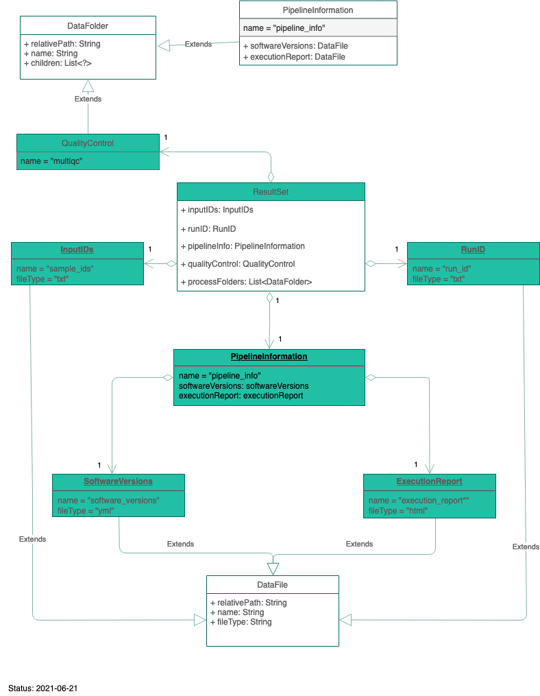
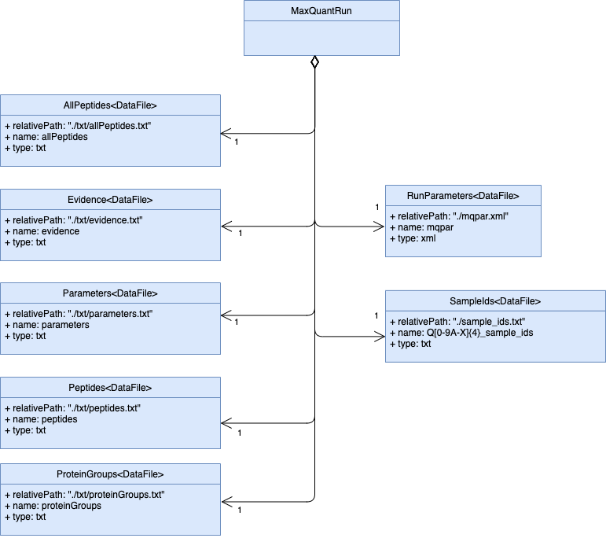

<div align="center">

#Data Model Library

[](https://github.com/qbicsoftware/data-model-lib/actions/workflows/build_package.yml)
[](https://github.com/qbicsoftware/data-model-lib/actions/workflows/run_tests.yml)
[](https://github.com/qbicsoftware/data-model-lib/actions/workflows/codeql-analysis.yml)
[](https://github.com/qbicsoftware/data-model-lib/releases)

[](https://github.com/qbicsoftware/data-model-lib/blob/main/LICENSE)


Data Model Library - A collection of QBiC data models.
</div>

## Overview:

- [How to Run](#how-to-run)
- [How to Use](#how-to-use)
- [Data Models](#data-models)
    * [Oxford Nanopore Data Structure](#oxford-nanopore-data-structure)
    
        * [Nanopore result set for registration at QBiC](#nanopore-result-set-for-registration-at-qbic)
        * [Nanopore usage example](#nanopore-usage-example)
        * [Nanopore data structures translated in openBIS](#nanopore-data-structures-translated-in-openbis)
        
    * [Nf-Core Bioinformatics Analysis Result Sets](#nf-core-bioinformatics-analysis-result-sets)
    
        * [NF-Core data structure for registration at QBiC](#nf-core-data-structure-for-registration-at-qbic)
        * [NF-Core usage example](#nf-core-usage-example)
        * [NF-Core data structures translated in openBIS](#nf-core-data-structures-translated-in-openbis)
        
    * [MaxQuant Result Sets](#maxquant-result-sets)
        
        * [MaxQuant data structure for registration at QBiC](#maxquant-data-structure-for-registration-at-qbic)
        * [MaxQuant usage example](#maxquant-usage-example)
        * [MaxQuant data structures translated in openBIS](#maxquant-data-structures-translated-in-openbis)   
        
- [DTOs - Data Transfer Objects](#dtos---data-transfer-objects)

    * [Imaging context - Omero and more](#imaging-context---omero)
    * [Business context - Offer Management and more](#business-context---offer-management)

## How to Run

Create a runable version of this code with maven and java 8:

```
> mvn clean package
```

The JAR file will be created in the ``/target`` folder, for example:

```
|-target
|---data-model-lib-1.0.0.jar
|---...
```


## How to Use

With Maven you can include the recent library version as dependency with:

```XML
<dependency>
  <groupId>life.qbic</groupId>
  <artifactId>data-model-lib</artifactId>
  <version>version-number</version>
</dependency>
```
or Groovy Grape:

```
@Grapes(
  @Grab(group='life.qbic', module='data-model-lib', version=<version-number>)
)
```

Make sure, that you have defined the Github package Maven repository, in order for Maven to resolve the dependency properly:

```XML
<repositories>
  <repository>
    <id>github</id>
    <name>GitHub OWNER Apache Maven Packages</name>
    <url>https://maven.pkg.github.com/qbicsoftware/data-model-lib</url>
    <releases><enabled>true</enabled></releases>
    <snapshots><enabled>true</enabled></snapshots>
  </repository>
</repositories>
```

## Data Models

### Oxford Nanopore data structure

#### Nanopore result set for registration at QBiC

A Nanopore NGS measurement output is delivered to us as a nested folder structure, following this model:


#### Nanopore usage example

For usage examples, see the [usage documentation](./doc/examples.md).

For directory examples, see the [JSON example files](./src/test/resources) provided for the unit tests.

#### Nanopore data structures translated in openBIS

The Nanopore data structure is saved in an openBIS 18.06.2 database. 
An overview of the openBIS data model and the location and entity relationship of the Nanopore data stucture within it can be seen in this diagram: 


### NF-Core bioinformatics analysis result sets

#### NF-Core data structure for registration at QBiC

A NF-Core pipeline directory output is provided as a nested folder structure, following this model:


#### NF-Core usage example

For usage examples, see the [usage documentation](./doc/examples.md).

For directory structure examples, see the [JSON example files](./src/test/resources/examples/resultset) provided for the unit tests.

#### NF-Core data structures translated in openBIS

The following figure displays the current openBIS model of a nf-core pipeline result dataset:


### MaxQuant result sets

#### MaxQuant data structure for registration at QBiC

A MaxQuant directory output is provided as a nested folder structure, following this model:


#### MaxQuant usage example

For usage examples, see the [usage documentation](./doc/examples.md).

For directory structure examples, see the [JSON example files](./src/test/resources/examples/resultset/maxquant) provided for the unit tests.

#### MaxQuant data structures translated in openBIS

The following figure displays the current openBIS model of a MaxQuant result dataset:


## DTOs - Data Transfer Objects

DTOs are objects that we pass around crossing architectural boundaries.
They don't contain any business logic, they are just representing data.

This DTO collection contains classes, that represent real world
life-science domain data assets.

### Imaging Context - Omero

The following figure describes the entity relation of the imaging DTOs.


Please have a look at the detailed JavaDoc class description of the
DTOs.


### Business Context - Offer Management

The following figure describes the entity relation of the DTOs related to Offer Management.
 


Detailed Information can be found in the GroovyDoc class description of the
DTOs.
